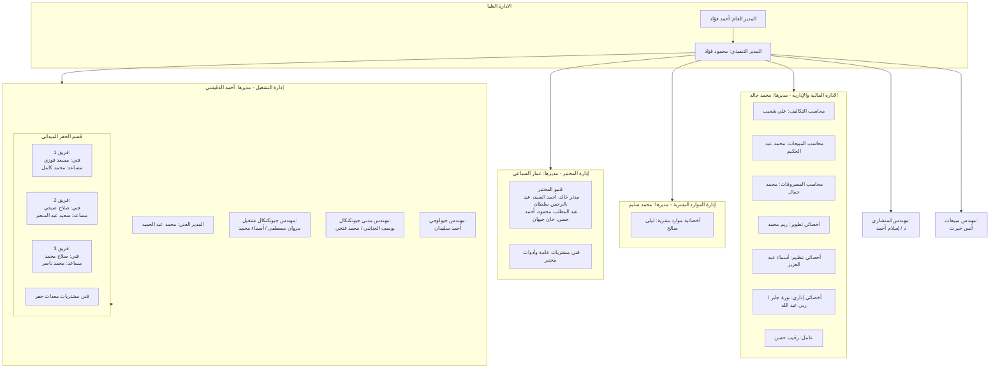

# المخطط الفني والتجاري لنظام رامسسكو (Ramssko Lab ERP/LIMS)
## الجزء الأول: الملخص التنفيذي، قاموس المصطلحات، والهيكل التنظيمي
**الملف:** `00_Executive_Summary_and_Glossary.md`

---

### 1. الملخص التنفيذي (Executive Summary)

يُمثل نظام **رامسسكو الموحد (Ramssko Lab ERP/LIMS)** الحل التقني المتكامل والمصمم خصيصاً لإدارة عمليات فحص التربة، وهندسة الأساسات، واختبارات مواد البناء، وحفر الجسات ميدانياً، بالإضافة إلى إدارة العمليات الخلفية (Back-office Operations) بما يشمل الموارد البشرية، والمالية والمحاسبة، وإدارة الأصول الثابتة والمخازن.

يستهدف النظام الانتقال بالعمليات التشغيلية لمختبر رامسسكو من الإجراءات اليدوية والورقية إلى نظام رقمي موحد، معتمد دولياً وحكومياً، من خلال تلبية ثلاثة متطلبات تقنية وتنظيمية كبرى:
1. **معيار الجودة الدولي (ISO/IEC 17025):** لضمان كفاءة ودقة مختبرات الفحص والمعايرة من خلال أتمتة إدخال البيانات ومراجعتها الفنية الصارمة، وإعادة الاختبارات غير المطابقة، ومراقبة معايرة الأجهزة.
2. **الربط الحكومي المالي (ZATCA):** التكامل المباشر مع هيئة الزكاة والضريبة والجمارك بالمملكة العربية السعودية لتقديم الفواتير الإلكترونية والضرائب وفق المرحلة الثانية (الربط والتكامل).
3. **التكامل المالي مع الأنظمة الخارجية:** الربط التام والمباشر مع نظام **Microtek** المالي لضمان تماسك ومطابقة القيود المحاسبية.

سيعمل النظام كمنظومة **مونوث نمطي (Modular Monolith)** باستخدام بيئة العمل **Laravel** كواجهة برمجة تطبيقات (API) في الخلفية، و**Vue.js** مع متجر **Pinia** لإدارة الحالة في الواجهة الأمامية، لتوفير تجربة مستخدم ديناميكية وتكاملية ممتازة مع الحفاظ على استقلالية موديولات النظام.

---

### 2. قاموس المصطلحات البرمجية والتجارية (Domain Glossary)

يضم الجدول التالي جميع المصطلحات التشغيلية والفنية المعتمدة في النظام استناداً إلى الوثائق الرسمية ومحاضر الاجتماعات الفنية لمختبر رامسسكو:

| المصطلح بالعربية | المصطلح بالإنجليزية | الاختصار | التعريف الفني والتجاري في النظام |
| :--- | :--- | :--- | :--- |
| **جسّة** | Borehole | **BH** | حفرة رأسية يتم حفرها في التربة لأعماق مختلفة للحصول على عينات وتحديد خصائص التربة وتصنيف طبقاتها الجيولوجية. |
| **جسّة استكشافية** | Exploratory Borehole | **-** | نوع من الجسات يُنفذ لتحديد الخصائص والمواصفات العامة والمبدئية للتربة ومستوى المياه الجوفية في الموقع. |
| **كارت تفاصيل الجسة** | Borehole Detail Card | **-** | بطاقة رقمية موحدة في النظام تسجل البيانات الأساسية للجسّة (اسم المشروع، اسم العميل، رقم المشروع، الموقع الجغرافي). |
| **أمر الشغل** | Work Order | **WO** | مستند رسمي نظامي يصدر تلقائياً فور موافقة العميل الموثقة على عرض السعر والاعتماد المالي لبدء التنفيذ الميداني والمعملي. |
| **اختبار الكثافة الحقلية** | Field Density Test | **FDT** | اختبار ميداني لتحديد كثافة التربة الجافة ودرجة الدمك في الموقع طبقاً للمواصفة **ASTM D1556** باستخدام طريقة مخروط الرمل. |
| **طريقة مخروط الرمل** | Sand Cone Method | **-** | آلية الفحص الميداني المعتمدة لقياس كثافة التربة الطبيعية عبر حفر حفرة قياسية وتعبئتها برمل فحص معير. |
| **اختبار الدمك** | Compaction / Proctor Test | **PRT** | اختبار معملي يحدد العلاقة بين محتوى الرطوبة والكثافة الجافة للتربة للوصول لأقصى دمك جاف ممكن طبقاً للمواصفة **ASTM D1557**. |
| **درجة الدمك المطلوبة** | Compaction Percentage | **-** | نسبة الكثافة الجافة الحقلية إلى الكثافة الجافة المعملية القصوى، ويشترط النظام لنجاح الاختبار أن تكون النتيجة **أكبر من 95% (> 95%)**. |
| **اختبار الهبوط** | Slump Test | **-** | اختبار ميداني للخرسانة الطازجة لتحديد قوامها ومدى سهولة تشغيلها، وتسجل بياناته في شيت "ملاحظات صب الخرسانة". |
| **اختبار تكسير الخرسانة** | Compressive Strength Test | **CST** | اختبار معملي لقياس مقاومة الضغط للمكعبات الخرسانية بعد غمرها في الماء لمعرفة مدى تحملها للأحمال الإنشائية. |
| **حوض المعالجة** | Curing Tank | **-** | حوض مائي معالج معملياً تُحفظ فيه المكعبات الخرسانية بعد الصب لمدد زمنية محددة (7 أيام و28 يوماً) قبل اختبار الكسر. |
| **نسبة نجاح تكسير الخرسانة** | Concrete Success Rate | **-** | نسبة المقاومة المحققة مقارنة بالمقاومة التصميمية المستهدفة، ويشترط النظام ألا تقل النتيجة عن **75% كحد أدنى** للنجاح. |
| **اختبار القلب الخرساني** | Core Test | **CRT** | اختبار شبه متلف يتم بأخذ عينة أسطوانية (قلب خرساني) من العناصر الإنشائية المتصلدة بالموقع وفحصها بالمعمل لتحديد مقاومتها الفعلية. |
| **مطرقة شميدت** | Schmidt Hammer Test | **SHT** | اختبار غير متلف لتحديد صلابة السطح للخرسانة المتصلدة وتقدير مقاومتها للضغط في الموقع بشكل تقريبي سريع. |
| **اختبار لوح التحميل** | Plate Loading Test | **PLT** | اختبار ميداني مستقل يُجرى لتقدير قدرة تحمل التربة التصميمية ومقدار الهبوط المتوقع تحت أحمال التأسيس، وله تقرير منفصل. |
| **معاملة زيارة للموقع** | Site Visit | **VST** | معاملة نظامية لتوثيق انتقال مهندس أو فني للموقع لإجراء معاينات سريعة أو تقديم استشارات ميدانية دون حفر أو اختبارات معقدة. |
| **حفر اختبارية** | Trial Pit Report | **TPR** | حفر مكشوفة يتم تنفيذها يدوياً أو ميكانيكياً لأعماق ضحلة لمعاينة وتوصيف طبقات التربة السطحية وأخذ عينات مقلقلة. |
| **اختبار المقاومة الكهربائية** | Electrical Resistivity Test | **ERT** | اختبار معملي أو ميداني لقياس مقاومة التربة لمرور التيار الكهربائي، ويستخدم في تصميم شبكات التأريض الكهربائي للمنشآت. |
| **اختبار تصنيف التربة** | Classification Test | **CLT** | مجموعة اختبارات معملية (كالتدرج الحبيبي وحدود اتربرج) لتحديد التركيب الميكانيكية للتربة وتصنيفها الهندسي. |
| **حدود اتربرج** | Atterberg Limits Test | **ALT** | اختبار معملي لتحديد محتوى الرطوبة الفاصل بين حالات القوام المختلفة (الصلبة، شبه الصلبة، اللدنة، السائلة) للتربة الناعمة. |
| **عمل فتحة بالكور للجسات** | Hole Core Drilling | **HOL** | عملية ثقب أو قطع خرساني أو أسفلتي لتمكين معدة الحفر من النفاذ وتنفيذ الجسة الاستكشافية في الأماكن المغطاة بالخرسانة/الأسفلت. |
| **شيت الاختبارات** | Test Sheet | **-** | نموذج إدخال البيانات الرقمي داخل النظام لتسجيل أوزان ونتائج الفحص والكسر وأبعاد العينات بدقة تامة. |
| **تذكرة المعاملة** | Transaction Ticket | **-** | الكيان البرمجي الممثل للمعاملة المالية والإدارية داخل النظام، والتي تُنشأ تلقائياً عند إصدار عرض السعر وتكون حالتها الأولية "معلقة". |
| **المعاملة المعلقة** | Pending Transaction | **-** | حالة المعاملة التي تم إصدار عرض سعر لها وبانتظار موافقة العميل وتوقيعه والتحصيل المالي، وتظهر في شاشة ملونة مخصصة للمتابعة. |
| **التوقيع الإلكتروني الممسوح** | Scanned Electronic Signature | **-** | ملف صورة لتوقيع العميل الفعلي المعتمد، يتم رفع للنظام للتثبت القانوني من موافقته على عرض السعر وأمر الشغل. |
| **دفعة التأمين المقدمة** | Upfront Deposit / Advance | **-** | مبلغ مالي يمثل **50% من القيمة الإجمالية** لعرض السعر، يشترط النظام تحصيله والتأكد منه محاسبياً لبدء أي عمل تشغيلي. |

---

### 3. الهيكل التنظيمي وصلاحيات النظام (Organizational Structure & RBAC Mapping)

تم استخلاص الهيكل الإداري والتشغيلي بالكامل من سجلات شؤون الموظفين الرسمية لمختبر رامسسكو وتعيينها إلى أدوار برمجية محددة بصلاحيات مستندة إلى الأدوار (Role-Based Access Control - RBAC) داخل النظام:

#### جدول توزيع الصلاحيات والأدوار البرمجية (RBAC Roles & Permissions)

تتوزع الصلاحيات البرمجية بشكل صارم لمنع تداخل الاختصاصات وضمان حوكمة البيانات والامتثال لمعيار ISO 17025:

| الدور الوظيفي بالنظام | المسؤول الفعلي (الاسم) | الصلاحيات البرمجية الرئيسية (System Permissions) |
| :--- | :--- | :--- |
| **Super Administrator / الإدارة العليا** | أحمد فؤاد / محمود فؤاد | - تحكم كامل بإعدادات النظام والمستخدمين والتهيئة الفنية. - اعتماد الخصومات المالية الاستثنائية والتقارير النهائية. - الاطلاع على لوحات التحكم والتقارير المالية والتشغيلية الموحدة. |
| **Financial Manager / مدير الحسابات** | محمد خالد | - اعتماد عروض الأسعار الصادرة مالياً وتعديل هيكل التسعير بالبلديات (الرياض/الدمام). - إحالة المعاملات والمراجعة المالية للفواتير. - تكامل الحسابات مع نظام Microtek المالي. |
| **Sales Accountant / محاسب المبيعات** | محمد عبد الحكيم | - مراجعة التحويلات البنكية ومطابقة صور إيصالات الدفع. - تسجيل الدفعة المقدمة (50%) كشرط لبدء أمر الشغل. - إصدار الفواتير الضريبية وتطبيق الخصومات المعول عليها. |
| **Cost Accountant / محاسب التكاليف** | علي شعيب | - إدخال ومراقبة التكاليف المباشرة والغير مباشرة للمشاريع والجسات. - حساب تكلفة الوقود، والمواد المستهلكة، وقطع الغيار. |
| **HR Manager / مدير الموارد البشرية** | محمد سليم / ليلى صالح | - إنشاء ملفات الموظفين وإدارة وتفعيل الدوام (ورديات / دوام كامل). - إدارة الأجندة الإدارية (Calendar & Emp Action) وتصنيف الوظائف. - متابعة الحضور والانصراف، وطلبات الإجازات، وتقييم أداء الموظفين. |
| **Operations Manager / مدير التشغيل** | أحمد الدقيشي | - تحويل المعاملات المعتمدة مالياً إلى المهندسين المختصين. - تعيين الفرق الحقلية وتوزيع جدول وجداول التنفيذ الزمني. - إدارة موديول الحفارات والمركبات وتكليف الأطقم الميدانية. |
| **Technical Director / المدير الفني** | محمد عبد الحميد | - الإشراف الهندسي العام على جودة التقارير الصادرة والامتثال للأكواد الكود السعودي للتربة. - الاعتماد الهندسي الفني النهائي لتقارير الجسات الجيوتقنية قبل التصدير للعميل. |
| **Geotechnical Engineer / مهندس جيوتقني** | مروان مصطفى / أسماء محمد / يوسف الجنايني / محمد فتحي | - دراسة وتحديد أنواع التقارير المطلوبة في مرحلة التقييم (Assessment). - إعداد التوصيات الهندسية للتأسيس وتحديد قدرة تحمل التربة التصميمية. - مراجعة وتدقيق نتائج الفحوصات المعملية والميدانية (FDT, Slump Test, Plate Load Test). |
| **Geological Engineer / مهندس جيولوجي** | أحمد سليمان | - استلام وتصنيف عينات التربة ميدانياً وتصويرها وتوثيق إحداثياتها وأعماقها بدقة. - إرسال العينات والنتائج الفنية الأولية لمجموعة التجهيز والتقارير بالمعمل. |
| **Lab Manager / مدير المختبر** | عمار السباعي | - إدارة وتوزيع العينات المستلمة على فنيي المختبر. - المصادقة الفنية على نتائج شيتات الاختبارات المدخلة. - تفعيل إجراءات إعادة الاختبار في حال كانت النتائج غير مطابقة لمعايير النجاح (مثل دمك أقل من 95%). |
| **Lab Technician / فني المختبر** | مدثر خالد / أحمد السيد / عبد الرحمن سلطان / عبد المطلب محمود / أحمد حسن / خان جيهان | - إجراء الفحوصات المعملية والميدانية للخرسانة والتربة. - تسجيل قراءات أبعاد المكعبات الخرسانية وأوزانها وإدخال نتائج كسر العينات في "شيت الاختبارات". |
| **Driller / فني حفار** | مسعد فوزي / صلاح صبحي / صلاح محمد | - واجهة تطبيق الهاتف (Mobile APP): تأكيد استلام المركبة، تسجيل فحص السائق والسيارة. - توثيق عمليات الحفر الميداني والرفع اللحظي لإحداثيات الجسة والصور والتوقيت. |
| **Sales Engineer / مهندس المبيعات** | أنس خيرت | - إدخال بيانات العملاء والفرص البيعية على نظام CRM. - إعداد وإصدار مسودات عروض الأسعار، وإرسالها للعميل ومتابعة الحصول على التوقيع الإلكتروني الممسوح. |
| **Consultant Engineer / مهندس استشاري** | د / إسلام أحمد | - مراجعة المشاريع الكبرى والمعقدة استشارياً، والمصادقة على التوصيات الهندسية الخاصة بالتأسيس. |
