# المخطط الفني والتجاري لنظام رامسسكو (Ramssko Lab ERP/LIMS)
## الجزء الثاني: بنية النظام والحدود المعمارية
**الملف:** `01_System_Architecture_and_Boundaries.md`

---

### 1. الفلسفة المعمارية للنظام (Architectural Philosophy)

يتبع تصميم نظام **رامسسكو الموحد** نمط **المونوث النمطي (Modular Monolith)**، وهي بنية معمارية تجمع بين سهولة النشر والتطوير للمونوث التقليدي، وقوة الفصل المعماري واستقلالية الموديولات التي تتميز بها الخدمات المصغرة (Microservices). 

#### الخلفية البرمجية (Backend - Laravel API):
* **الهيكلية النمطية:** يتم تنظيم الكود البرمجي في مجلدات مستقلة تماماً للموديولات داخل مجلد `app/Modules`. كل موديول (مثل `CoreLab`, `Finance`, `HR`) يمثل وحدة معزولة تحتوي على نماذج البيانات الخاصة بها (`Models`)، ومنطق العمل (`Actions/Services`)، والمتحكمات (`Controllers`)، والمسارات (`Routes`).
* **عزل قواعد البيانات وقنوات الاتصال:** تتبع الكيانات والبيانات تبعية صارمة للموديول المالك لها. لا يُسمح لموديول بالاستعلام المباشر من جداول موديول آخر. بدلاً من ذلك، يتم الاتصال البيني عبر:
  1. **واجهات الخدمات (Service Interfaces):** عقود برمجية معرفة بشكل واضح للنداءات المتزامنة.
  2. **الأحداث والمستمعين (Event Listeners / Observers):** للاتصال غير المتزامن وسير العمل الأحادي (مثال: إطلاق حدث `BoreholeWorkOrderApproved` في موديول التشغيل يقوم موديول المالية بالاستماع إليه لتهيئة التذكرة تلقائياً).

#### الواجهة الأمامية (Frontend - Vue.js & Pinia):
* **الهيكلية النمطية بالواجهة:** تُقسم الواجهات في Vue.js بالتوازي مع تقسيم الخلفية. يمتلك كل موديول مجلداً خاصاً به يحتوي على المكونات (`Components`)، والمشاهد (`Views`)، ومخازن الحالات المخصصة (`Pinia Stores` مثل `useCoreLabStore`, `useFinanceStore`).
* **إدارة الحالة:** يعمل متجر Pinia كمستودع مركزي لحالة الواجهة لكل موديول، مما يمنع التداخل التشغيلي للبيانات ويضمن تحديث البيانات في لوحة التحكم بشكل لحظي وديناميكي.

---

### 2. مصفوفة حدود الموديولات (Module Boundaries Matrix)

يوضح الجدول التالي ما يقع **داخل** حدود كل موديول (مسؤولياته المباشرة) وما يقع **خارجه** (الاعتمادات والتكاملات مع الموديولات الأخرى):

| الموديول البرمجي | ما يقع داخل حدود الموديول (Inside Boundary) | ما يقع خارج حدود الموديول (Outside Boundary) |
| :--- | :--- | :--- |
| **1. إدارة المختبر والعمليات الميدانية**<br>*(Core Lab & Field)* | - تسجيل بيانات الجسات وأعماقها الميدانية.<br>- إدارة استلام عينات التربة والخرسانة وتوثيق صورها.<br>- شيتات إدخال نتائج اختبارات (FDT, الدمك, الكسر, الهبوط).<br>- تطبيق الأكواد الفنية وإصدار التقارير الجيوتقنية والفنية. | - محاسبة تكاليف الجسات والتحصيل المالي (Finance).<br>- إدارة الحفارات كأصول ثابتة وتراخيصها (Assets).<br>- عقود المبيعات وتوقيعات العملاء (CRM).<br>- حضور وانصراف فنيي الحفر والمختبر (HR). |
| **2. الموارد البشرية**<br>*(HR Module)* | - إدارة ملفات وبيانات الموظفين ومسمياتهم.<br>- معالجة شؤون الموظفين (Calendar & Emp Action).<br>- تسجيل الحضور والانصراف وإدارة الإجازات.<br>- تفعيل نوع الدوام (ورديات / دوام كامل) وتقييم الأداء. | - صرف العهد المالية ومصروفات الحفارات (Finance).<br>- توزيع المهام اليومية للفرق في الموقع (Core Lab).<br>- تسجيل وتتبع المركبات والسيارات المستلمة (Assets). |
| **3. التسويق وعلاقات العملاء**<br>*(Marketing & CRM)* | - تسجيل بيانات العملاء الجدد والفرص البيعية.<br>- إعداد مسودات عروض الأسعار وحفظها للفرص.<br>- متابعة عروض السعر والحصول على توقيع العميل الإلكتروني.<br>- تنظيم الحملات التسويقية والاتصال الأولي بالعميل. | - تسعير الجسات والتحقق من حسابات البلديات (Finance).<br>- جدولة بدء العمل الميداني وإرسال الحفارات (Core Lab).<br>- دفع العميل عبر الموقع أو التحويل البنكي (Finance). |
| **4. التذاكر وبوابات الويب والموبايل**<br>*(Web/Mobile & Ticketing)* | - شاشة العرض الملونة لمتابعة المعاملات المعلقة.<br>- استقبال طلبات وتذاكر العملاء عبر بوابات الويب.<br>- واجهة الموبايل لرفع صور الجسات والإحداثيات لحظياً.<br>- واجهة الموبايل للحفارين والسائقين لفحص المركبة. | - منطق حساب أعداد الجسات بناءً على المساحة (Core Lab).<br>- مطابقة التحويلات البنكية محاسبياً (Finance).<br>- سجلات الصيانة الوقائية والطارئة للمركبات (Calibration). |
| **5. الصيانة والمعايرة**<br>*(Calibration & Maintenance)* | - جدولة وضبط تواريخ معايرة أجهزة الفحص والكسر.<br>- تسجيل عمليات صيانة الحفارات والسيارات والمعدات.<br>- إشعارات وتنبيهات مواعيد المعايرة والصيانة الدورية. | - إهلاك الأصول محاسبياً وإضافتها الدفترية (Fixed Assets).<br>- شراء قطع الغيار أو مستهلكات المعمل (Stock).<br>- تكليف الفني بالعمل الميداني (Core Lab). |
| **6. الأصول الثابتة والمخازن**<br>*(Fixed Assets & Stock)* | - سجل الأصول الثابتة (الحفارات، أجهزة المعمل، السيارات).<br>- ملف المركبات الشامل وتواريخ التراخيص والفحص.<br>- سجل استلام المركبات وتوقيع المستلمين.<br>- إدارة المخزون وقطع الغيار وأدوات المختبر والمستلزمات. | - معالجة الصيانة الفعلية للمركبات (Calibration).<br>- حساب تكلفة استهلاك الوقود والمصروفات (Finance).<br>- حضور سائقي ومساعدي الحفارات (HR). |
| **7. المالية ودفتر الأستاذ العام**<br>*(Finance & GL)* | - دليل الحسابات وقيد اليومية العامة والميزانية.<br>- مراجعة الأسعار وإصدار الفواتير الضريبية النهائية.<br>- مطابقة التحويلات المالية وتأمين الـ 50% دفعة مقدمة.<br>- تكامل الضرائب والفواتير الإلكترونية مع هيئة ZATCA. | - إدخال القراءات الفنية للاختبارات ومراجعتها (Core Lab).<br>- إرفاق مستندات التحويل البنكي من العميل (Web/Ticket).<br>- جمع بيانات أبعاد المشاريع مبدئياً (CRM). |

---

### 3. ملكية البيانات والكيانات (Data & Entity Ownership)

يحدد النموذج التالي بدقة الموديول المالك لكل كيان برمجي (Entity Ownership) داخل قاعدة البيانات الموحدة لمنع التداخل البرمجي ولضمان سلامة حوكمة البيانات:

```mermaid
flowchart TD
    %% Define Styles
    classDef moduleStyle fill:#0f172a,stroke:#3b82f6,stroke-width:2px,color:#93c5fd,font-weight:bold;
    classDef entityStyle fill:#1e293b,stroke:#475569,stroke-width:1.5px,color:#cbd5e1;

    subgraph CRM ["موديول علاقات العملاء CRM"]
        CRM_M["إدارة جهات الاتصال والمبيعات"]:::moduleStyle
        E_Cust["Customer\n(العميل)"]:::entityStyle
        E_Lead["Lead\n(الفرصة البيعية)"]:::entityStyle
        E_Quote["Quotation\n(عرض السعر)"]:::entityStyle
        CRM_M --- E_Cust & E_Lead & E_Quote
    end

    subgraph Tickets ["موديول التذاكر وبوابات الويب"]
        Tick_M["إدارة المعاملات والدعم"]:::moduleStyle
        E_Ticket["TransactionTicket\n(تذكرة المعاملة)"]:::entityStyle
        E_CTicket["ClientTicket\n(تذكرة الطلبات)"]:::entityStyle
        E_File["FileScan\n(المستندات الممسوحة)"]:::entityStyle
        Tick_M --- E_Ticket & E_CTicket & E_File
    end

    subgraph Lab ["موديول العمليات والمختبر Core Lab"]
        Lab_M["إدارة الفحوصات والتقارير"]:::moduleStyle
        E_BH["Borehole (الجسّة)"]:::entityStyle
        E_SS["SoilSample (عينة التربة)"]:::entityStyle
        E_CS["ConcreteSample (عينة الخرسانة)"]:::entityStyle
        E_TR["TestResult (نتيجة الاختبار)"]:::entityStyle
        E_SL["SlumpLog (سجل الهبوط)"]:::entityStyle
        E_CR["CompactionReport (تقرير الدمك)"]:::entityStyle
        E_GR["GeotechnicalReport (التقرير النهائي)"]:::entityStyle
        Lab_M --- E_BH & E_SS & E_CS & E_TR & E_SL & E_CR & E_GR
    end

    subgraph HR ["موديول الموارد البشرية HR"]
        HR_M["إدارة الموظفين والدوام"]:::moduleStyle
        E_Emp["Employee (الموظف)"]:::entityStyle
        E_Att["Attendance (الحضور والانصراف)"]:::entityStyle
        E_Leave["LeaveRequest (طلب الإجازة)"]:::entityStyle
        E_Shift["WorkShift (الوردية/الدوام)"]:::entityStyle
        E_Eval["EvaluationTask (مهمة التقييم)"]:::entityStyle
        HR_M --- E_Emp & E_Att & E_Leave & E_Shift & E_Eval
    end

    subgraph Assets ["موديول الأصول والمستودعات Assets & Stock"]
        Asset_M["إدارة المركبات والقطع"]:::moduleStyle
        E_Asset["FixedAsset (الأصل الثابت)"]:::entityStyle
        E_Veh["VehicleDetail (ملف المركبة)"]:::entityStyle
        E_VehHO["VehicleHandover (سجل الاستلام)"]:::entityStyle
        E_Item["StockItem (مادة مخزنية)"]:::entityStyle
        E_InvTx["InventoryTransaction (حركة مخزنية)"]:::entityStyle
        Asset_M --- E_Asset & E_Veh & E_VehHO & E_Item & E_InvTx
    end

    subgraph Calib ["موديول الصيانة والمعايرة Calibration"]
        Cal_M["إدارة صيانة ومعايرة المعدات"]:::moduleStyle
        E_Maint["MaintenanceLog (سجل الصيانة)"]:::entityStyle
        E_CalRec["CalibrationRecord (سجل المعايرة)"]:::entityStyle
        Cal_M --- E_Maint & E_CalRec
    end

    subgraph Finance ["موديول المالية Finance & GL"]
        Fin_M["إدارة القيود والربط والفوترة"]:::moduleStyle
        E_Inv["Invoice (الفاتورة الضريبية)"]:::entityStyle
        E_Rcpt["PaymentReceipt (سند القبض)"]:::entityStyle
        E_JE["JournalEntry (قيد اليومية)"]:::entityStyle
        E_Tax["TaxSetting (إعدادات الضريبة)"]:::entityStyle
        Fin_M --- E_Inv & E_Rcpt & E_JE & E_Tax
    end

    %% Styles for subgraphs
    style CRM fill:#0f172a,stroke:#1e3a8a,stroke-width:1.5px,color:#93c5fd;
    style Tickets fill:#0f172a,stroke:#1e3a8a,stroke-width:1.5px,color:#93c5fd;
    style Lab fill:#0f172a,stroke:#1e3a8a,stroke-width:1.5px,color:#93c5fd;
    style HR fill:#0f172a,stroke:#1e3a8a,stroke-width:1.5px,color:#93c5fd;
    style Assets fill:#0f172a,stroke:#1e3a8a,stroke-width:1.5px,color:#93c5fd;
    style Calib fill:#0f172a,stroke:#1e3a8a,stroke-width:1.5px,color:#93c5fd;
    style Finance fill:#0f172a,stroke:#1e3a8a,stroke-width:1.5px,color:#93c5fd;
```



---

### 4. مخطط سياق النظام والربط الخارجي (Mermaid.js C4 Context Diagram)

يوضح المخطط التالي سياق النظام العام (**Ramssko Lab System**) وتفاعله مع المستخدمين المختلفين، بالإضافة إلى قنوات الربط الإلكتروني المباشر مع الأنظمة الحكومية والبرمجيات الخارجية والخدمات السحابية:

```mermaid
flowchart TB
    %% Styling Definition
    classDef userStyle fill:#1e3a8a,stroke:#172554,stroke-width:2px,color:#ffffff;
    classDef systemStyle fill:#0f172a,stroke:#1e293b,stroke-width:3px,color:#ffffff;
    classDef moduleStyle fill:#eff6ff,stroke:#2563eb,stroke-width:2px,color:#1e40af;
    classDef extStyle fill:#fff5f5,stroke:#ef4444,stroke-width:2px,color:#991b1b;

    %% Users & Actors
    subgraph Users ["المستفيدون من النظام"]
        Client["العميل النهائي\n(Client)\n[بوابة الويب / تطبيق الهاتف]"]:::userStyle
        OfficeStaff["موظفو الإدارة والمبيعات\n(Office Staff)\n[لوحة التحكم بالمتصفح]"]:::userStyle
        LabStaff["فنيو ومدير المختبر\n(Lab Staff)\n[شاشة شيت الاختبارات]"]:::userStyle
        FieldTeam["فريق الحفر والمهندسين الجيولوجيين\n(Field Drillers & Geologists)\n[تطبيق الهاتف المحمول]"]:::userStyle
    end

    %% Internal System (Modular Monolith)
    subgraph SystemBoundary ["نظام رامسسكو الموحد (Ramssko Lab ERP/LIMS)"]
        direction TB
        ERP_Core["بوابة النظام والواجهة الخلفية الموحدة\n(Laravel Core API & Vue.js Dashboard)"]:::systemStyle

        subgraph Modules ["الموديولات البرمجية المعزولة (Laravel Modules)"]
            M_CoreLab["إدارة المختبر والعمليات الميدانية\n(Core Lab & Field Operations)"]:::moduleStyle
            M_HR["إدارة الموارد البشرية\n(Human Resources & Calendar)"]:::moduleStyle
            M_CRM["التسويق وعلاقات العملاء\n(Marketing & CRM)"]:::moduleStyle
            M_Ticketing["بوابة التذاكر والمعاملات المعلقة\n(Ticketing & Statuses)"]:::moduleStyle
            M_Calibration["الصيانة والمعايرة للأجهزة والأصول\n(Calibration & Maintenance)"]:::moduleStyle
            M_Assets["الأصول الثابتة والمخازن\n(Fixed Assets & Stock)"]:::moduleStyle
            M_Finance["الإدارة المالية ودفتر الأستاذ العام\n(Finance & GL)"]:::moduleStyle
        end
    end

    %% External Systems & Integrations
    subgraph ExternalSystems ["الأنظمة الخارجية والربط الحكومي"]
        ZATCA["هيئة الزكاة والضريبة والجمارك (ZATCA)\n[الفاتورة الإلكترونية والمرحلة الثانية]"]:::extStyle
        Microtek["نظام Microtek المالي\n[مزامنة القيود والحسابات الختامية]"]:::extStyle
        GoogleMaps["خدمة خرائط جوجل (Google Maps API)\n[التوثيق الجغرافي وتقييم مواقع الجسات]"]:::extStyle
    end

    %% Interactions and Connections
    %% Users to Dashboard/Apps
    Client -->|إنشاء معاملة، تتبع التقارير، سداد الدفعات| ERP_Core
    OfficeStaff -->|إدارة الحسابات، المبيعات، شؤون الموظفين| ERP_Core
    LabStaff -->|إدخال نتائج تكسير الخرسانة والدمك| ERP_Core
    FieldTeam -->|تسجيل استلام السيارة، رفع إحداثيات الجسات| ERP_Core

    %% Dashboard routes to specific Modules
    ERP_Core --> M_Ticketing
    ERP_Core --> M_CRM
    ERP_Core --> M_CoreLab
    ERP_Core --> M_Finance
    ERP_Core --> M_HR
    ERP_Core --> M_Assets
    ERP_Core --> M_Calibration

    %% Module to Module Internal Interaction examples (via Events/Interfaces)
    M_CRM -.->|تحويل موافقة العميل والتوقيع| M_CoreLab
    M_CoreLab -.->|إرسال عينات التربة والخرسانة| M_Ticketing
    M_Ticketing -.->|إنشاء معاملة معلقة ملونة| M_Finance
    M_Finance -.->|تأكيد تحصيل 50% مقدم| M_CoreLab
    M_Assets -.->|توفير بيانات الحفارات والسيارات| M_Calibration
    M_Calibration -.->|إرسال إشعارات تنبيهات الصيانة| M_HR

    %% Module to External integrations
    M_Finance ===>|إرسال الفواتير والضريبة إلكترونياً| ZATCA
    M_Finance ===>|مزامنة الحركات والقيود المالية| Microtek
    M_CoreLab ===>|تحديد وتوثيق إحداثيات الموقع الفعلي| GoogleMaps
