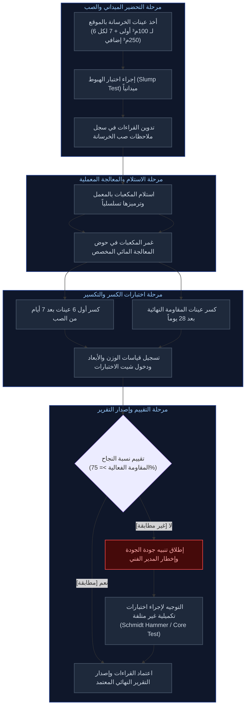
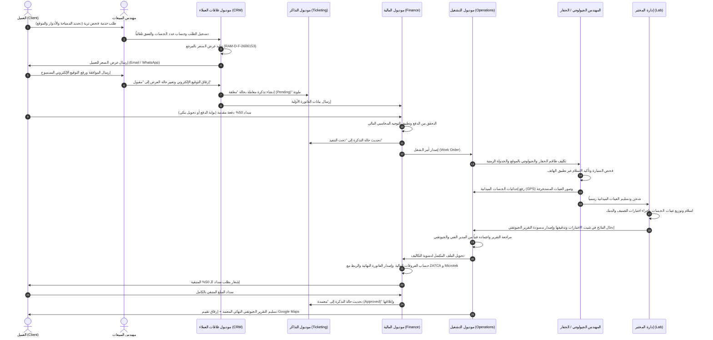
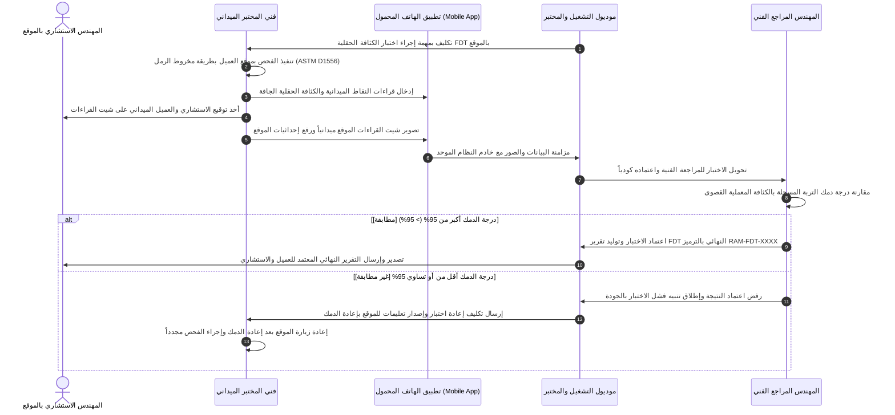
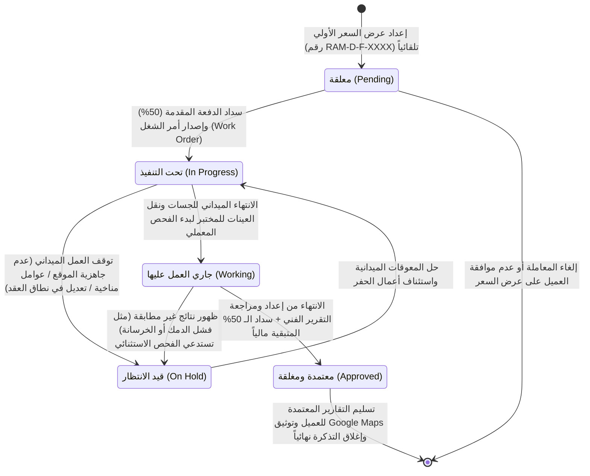

# المخطط الفني والتجاري لنظام رامسسكو (Ramssko Lab ERP/LIMS)
## الجزء الثالث: دورات عمل الكيانات ودورات الحياة
**الملف:** `02_Business_Workflows_and_Lifecycles.md`

---

### 1. دورة حياة الجسة الاستكشافية (Borehole Lifecycle)

تبدأ دورة حياة الجسة الاستكشافية من الاتصال الأولي بالعميل وتنتهي بتسليم التقرير الجيوتقني وإغلاق المعاملة مالياً، وتتكون من المراحل المتسلسلة التالية:

```mermaid
flowchart TD
    %% Define Styles for visual excellence
    classDef stageStyle fill:#0f172a,stroke:#3b82f6,stroke-width:2px,color:#60a5fa,font-weight:bold;
    classDef stepStyle fill:#1e293b,stroke:#475569,stroke-width:1.5px,color:#cbd5e1;
    
    subgraph Stage1 ["المرحلة الأولى: الاتصال والتعاقد المالي"]
        direction LR
        A["استفسار العميل المبدئي"]:::stepStyle --> B["حساب التسعير تلقائياً بالنظام"]:::stepStyle
        B --> C["إصدار عرض السعر برقم مرجع"]:::stepStyle
        C --> D["الموافقة والتوقيع الإلكتروني للعميل"]:::stepStyle
        D --> E["تحصيل دفعة التأمين المقدمة 50%"]:::stepStyle
    end
    
    subgraph Stage2 ["المرحلة الثانية: التجهيز والتنفيذ الميداني"]
        direction LR
        F["توليد أمر الشغل WO"]:::stepStyle --> G["تجهيز الموقع وجدولة الفرق"]:::stepStyle
        G --> H["حفر الجسات واستخراج العينات"]:::stepStyle
        H --> I["التصوير الميداني وتوثيق الـ GPS"]:::stepStyle
    end
    
    subgraph Stage3 ["المرحلة الثالثة: الفحص والاختبار المعملي"]
        direction LR
        J["شحن وإرسال العينات للمعمل"]:::stepStyle --> K["إجراء الاختبارات والتحليل الفني"]:::stepStyle
        K --> L["تسجيل القراءات في شيت الاختبارات"]:::stepStyle
        L --> M["المراجعة الفنية والاعتماد الهندسي"]:::stepStyle
    end
    
    subgraph Stage4 ["المرحلة الرابعة: الإنهاء المالي والتسليم"]
        direction LR
        N["الفوترة وتسوية التكاليف الفعلية"]:::stepStyle --> O["تحصيل الدفعة المتبقية 50%"]:::stepStyle
        O --> P["إرسال التقرير النهائي المعتمد"]:::stepStyle
        P --> Q["التوثيق الجغرافي برابط Google Maps"]:::stepStyle
    end

    %% Inter-stage connections
    E --> F
    I --> J
    M --> N
    
    %% Apply general graph styles
    style Stage1 fill:#0f172a,stroke:#1e3a8a,stroke-width:1.5px,color:#93c5fd;
    style Stage2 fill:#0f172a,stroke:#1e3a8a,stroke-width:1.5px,color:#93c5fd;
    style Stage3 fill:#0f172a,stroke:#1e3a8a,stroke-width:1.5px,color:#93c5fd;
    style Stage4 fill:#0f172a,stroke:#1e3a8a,stroke-width:1.5px,color:#93c5fd;
```

1. **الاستفسار والتقييم (Inquiry & Assessment):**
   * يقوم مهندس المبيعات بإدخال مواصفات المبنى (نوع المبنى: سكني/تجاري، مساحة الأرض الكلية، وعدد الأدوار).
   * يقوم النظام تلقائياً بتحديد عدد الجسات المطلوبة كحد أدنى بناءً على كود البناء السعودي (مثال: مساحة 200-300 متر مربع تتطلب 3 جسات كحد أدنى).

2. **عرض السعر المالي (Quotation Stage):**
   * يُنشئ النظام عرض سعر رسمي برقم مرجعي فريد يتخذ التنسيق التلقائي (مثال: `RAM-D-F-2606153`).
   * يتم تسعير الجسة أو سعر المتر بناءً على نطاق عمل البلدية المعتمدة (الرياض أو الدمام) وعمق الجسات المطلوب.
   * يُرسل عرض السعر تلقائياً للعميل عبر البريد الإلكتروني أو الواتساب، وتتحول حالة المعاملة في لوحة التحكم إلى "معلقة" مع توليد تذكرة (Ticket) ملونة.

3. **الاعتماد والتوقيع (Customer Approval & Signing):**
   * يعتمد العميل عرض السعر برفع توقيعه الإلكتروني الممسوح ضوئياً (Scanned Electronic Signature) عبر بوابة العميل الإلكترونية.

4. **التسوية والتحصيل الأولي (Upfront Payment & Validation):**
   * يقوم العميل بسداد **50% كدفعة مقدمة / تأمين** (عبر السداد الإلكتروني أو تحويل بنكي مع رفع إيصال الدفع).
   * يراجع محاسب المبيعات الدفعة، ويعتمدها بالنظام، وتتحول حالة المعاملة إلى **"معاملة جاهزة"**.

5. **الجدولة والتنفيذ الميداني (Field Scheduling & Execution):**
   * يحول النظام المعاملة لقسم التشغيل، ويصدر مدير التشغيل أمر الشغل (Work Order) وتعيين فريق الحفر والجيولوجي.
   * يتم استلام صور الموقع الجغرافي، وتحديد جدول التنفيذ الزمني، وانتقال المركبات والمعدات.
   * يقوم فني الحفر ميدانياً بحفر الجسة الفعلي وتوثيق أعماقها وأخذ العينات الممثلة.
   * يقوم المهندس الجيولوجي بتوثيق إحداثيات الجسة الجغرافية بالـ GPS، ووقت أخذ العينة، وتصوير عينات التربة الميدانية.

6. **الاختبارات المعملية والتقارير (Lab Testing & Review):**
   * تُرسل عينات التربة إلى المعمل تحت إشراف المهندس المختص.
   * يوزع مدير المختبر العينات على فنيي المعمل لإجراء فحوصات التصنيف والدمك وحدود اتربرج.
   * يتم تسجيل الأوزان والنتائج في "شيت الاختبارات"، وتدقيقها من قبل المراجع الفني للتأكد من مطابقتها لكود التربة المعتمد.
   * يُصدر الجيولوجي والمدير الفني التقرير النهائي (تقرير الجسات BH Report) المحتوي على التوصيات وقدرة التحمل.

7. **الإنهاء المالي والتسليم (Financial Closure & Delivery):**
   * يحال الملف للحسابات، ويتم مراجعة التكاليف الفعلية مقابل المقدرة، وإجراء التعديلات إن وجدت.
   * يُطلب من العميل سداد الـ 50% المتبقية من قيمة المشروع.
   * فور إتمام السداد، يتم إصدار الفاتورة الضريبية النهائية والربط مع ZATCA و Microtek.
   * يُرسل التقرير المعتمد النهائي للعميل بالوسائل المتاحة، ويرفق تقييم الموقع عبر خرائط Google Maps في سجل المعاملة بالنظام.

---

### 2. دورة حياة اختبارات الخرسانة (Concrete Testing Lifecycle)

تنظم هذه الدورة عمليات استلام وحفظ واختبار مكعبات الخرسانة الواردة من المواقع الإنشائية للتحقق من كفاءتها ومطابقتها للمواصفات:

1. **أخذ العينات الميدانية (Site Sampling):**
   * يتم أخذ العينات بناءً على حجم صب الخرسانة في الموقع: **6 عينات لحجم 100م³ الأولى**، ويضاف **7 عينات إضافية لكل 250م³ إضافي**.
   * يتم ترميز العينات وكتابة بياناتها: (الرقم التسلسلي، مكان الصب بالتحديد، وتاريخ الصب).

2. **اختبار الهبوط (Slump Test):**
   * يجرى اختبار الهبوط ميدانياً للخرسانة الرطبة قبل الصب، وتسجل الملاحظات والقيم فوراً في سجل "ملاحظات صب الخرسانة".

3. **الاستلام والمعالجة (Receiving & Curing):**
   * تُنقل المكعبات الخرسانية إلى المعمل، وتوضع في حوض المعالجة المائي المخصص للتحكم في رطوبتها وتصلدها الطبيعي.

4. **اختبار التكسير (Crushing Tests):**
   * **مرحلة الـ 7 أيام:** يتم سحب أول **6 عينات** من حوض المعالجة بعد مرور 7 أيام من تاريخ الصب، وقياس وزنها وأبعادها (الطول، العرض، الارتفاع) بدقة، ثم تكسيرها بمكبس هيدروليكي لتسجيل مقاومة الضغط الأولية في "شيت الاختبارات".
   * **مرحلة الـ 28 يوماً:** يتم سحب واختبار العينات المتبقية بعد مرور 28 يوماً للحصول على القوة التصميمية النهائية للخرسانة.

5. **تقييم ومطابقة النتائج (Evaluation & Compliance):**
   * يحتسب النظام تلقائياً مقاومة التكسير، ويشترط لنجاح الاختبار ألا تقل النتيجة عن **75% كحد أدنى** من القوة التصميمية المطلوبة.
   * **إجراءات النتائج غير المطابقة:** في حال فشل العينة (أقل من 75%)، يطلق النظام تنبيهاً بالجودة للجوانب الإدارية والفنية، ويوصي النظام بإجراء اختبارات غير متلفة إضافية مثل **مطرقة شميدت (Schmidt Hammer)** أو سحب عينة قلب خرساني **(Core Test)** للتحقق من صلب العنصر الإنشائي المشكوك فيه بالموقع.

---

### 3. مخطط التتابع التشغيلي للجسات (Borehole Sequence Diagram)

يوضح المخطط التالي تتابع نداءات العمليات والبيانات بين جميع أطراف النظام والموديولات المنفصلة لتنفيذ معاملة الجسات من البداية وحتى الإغلاق:

---

### 4. مخطط التتابع لاختبار الكثافة الحقلية (FDT Sequence Diagram)

يوضح المخطط التالي دورة العمل الفنية الميدانية لاختبار الكثافة الحقلية للتربة (FDT) وآلية معالجة النتائج المطابقة وغير المطابقة لمعايير الجودة:

---

### 5. مخطط آلة الحالة للتذكرة والمعاملة (Ticket State Machine Diagram)

يتحكم النظام بحالة المعاملة والتذكرة بنظام أوتوماتيكي دقيق يربط بين الموافقة المالية والعمليات التشغيلية، ويوضح مخطط آلة الحالة التالي الانتقالات بين الحالات التشغيلية الخمس المعتمدة بالنظام:

