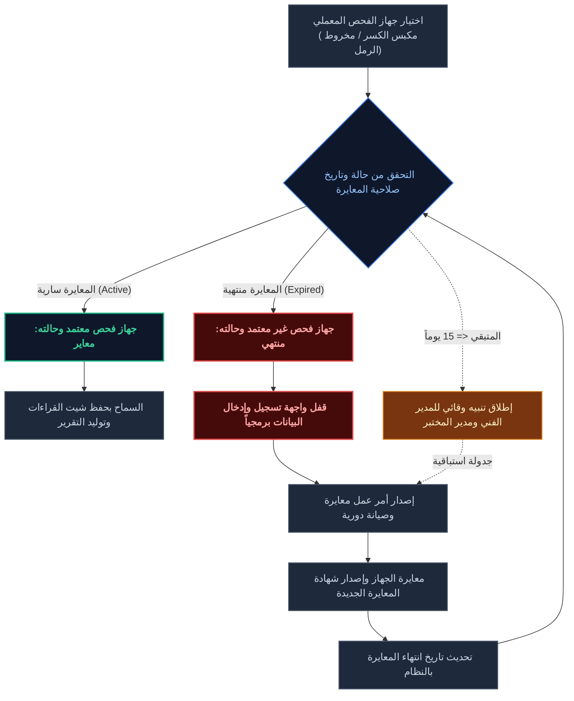

# المخطط الفني والتجاري لنظام رامسسكو (Ramssko Lab ERP/LIMS)
## الجزء الخامس: العمليات الميدانية وإدارة المختبرات
**الملف:** `04_Field_Operations_and_Lab_Management.md`

---

### 1. الخطوات التنفيذية والميدانية للحفر والجس (Field Execution Steps)

تسير العمليات الميدانية لحفر الجسات واستخراج العينات وفق بروتوكول صارم يضمن جودة العينات ودقة تحديد المواقع الجغرافية للتأسيس:

1. **تجهيز الموقع والتحقق الجغرافي (Site Preparation & Survey):**
   * فور صدور أمر الشغل (Work Order)، يراجع مهندس التشغيل صور الموقع المرفوعة.
   * يتم تحديد مخطط الحفر الجغرافي وجدول التنفيذ الزمني بدقة وتثبيت الموقع عبر خرائط Google Maps.
   * يقوم فني الحفر بإجراء الفحص اليومي للمركبة والحفار عبر تطبيق الهاتف لتأكيد الجاهزية الميكانيكية.

2. **تحرك الفريق وتحديد نقاط الجس (Mobilization & Point Staking):**
   * ينتقل طاقم الحفر (فني الحفار ومساعده) برفقة المهندس الجيولوجي للموقع.
   * يتم توثيق الإحداثيات الجغرافية لبدء العمل الفعلي باستخدام الـ GPS المدمج بالهاتف لتأكيد التواجد داخل حدود أرض العميل.

3. **عمليات الحفر الميكانيكي (Drilling Operations):**
   * يتم تنفيذ الحفر الرأسي باستخدام آلة الحفر (Drilling Rig) للوصول للأعماق المطلوبة.
   * في حال وجود طبقات خرسانية أو أسفلتية سطحية، يتم استخدام منشار الكور لعمل فتحة بالكور للجسات (Hole Core - HOL) لتمكين آلة الحفر من النفاذ.
   * يتم الحفر القياسي للجسات الاستكشافية بالأعماق المحددة (مثال: جستين بعمق 7 أمتار وجسة بعمق 10 أمتار).

4. **أخذ وتوثيق عينات التربة (Soil Sampling & Visual Logging):**
   * يتم استخراج عينات التربة من الجسة من أعماق مختلفة ومتنوعة من سطح الأرض.
   * يقوم المهندس الجيولوجي المختص باستلام عينات التربة وتصنيفها بصرياً وتصويرها.
   * يُلزم النظام الجيولوجي بتدوين كافة التفاصيل الميدانية لكل عينة: (وقت الاستخراج، الإحداثيات الجغرافية الدقيقة للجسّة، وعمق استخراج العينة).

5. **شحن وتسليم العينات للمعمل (Sample Dispatch):**
   * يتم حفظ عينات التربة في أوعية محكمة الإغلاق ومصنفة ببطاقات تعريفية رقمية لضمان عدم اختلاطها.
   * تُشحن العينات إلى مقر مختبر رامسسكو وتسلم رسمياً تحت إشراف وتوجيه المهندس المختص لبدء دورة الاختبارات.

---

### 2. معايير وأكواد الاختبارات المعملية والميدانية (Lab Testing Standards)

تُدار وتُنفذ كافة الفحوصات المعملية والميدانية للتربة والمواد الإنشائية بموجب الأكواد والمعايير الدولية لضمان موثوقية الاعتماد:

#### أ. اختبار الدمك معملياً (Compaction Test - ASTM D1557):
* **الغرض:** تحديد العلاقة بين محتوى الرطوبة والكثافة الجافة للتربة للوصول لأقصى كثافة جافة (Modified Proctor).
* **الإجراء:** يتم دمك عينة التربة في قالب قياسي على خمس طبقات باستخدام مطرقة ميكانيكية بوزن وأبعاد محددة.
* **النتائج:** يتم رسم منحنى الدمك وتحديد "الرطوبة المثلى" و"الكثافة الجافة القصوى" لإرسالها لمجموعة اختبارات التربة كمرجع لاختبارات الموقع.

#### ب. اختبار الكثافة الحقلية ميدانياً (Field Density Test - ASTM D1556):
* **الغرض:** قياس كثافة التربة الجافة الفعلية المدموكة في الموقع للتأكد من جودة الأعمال الترابية للمقاول.
* **طريقة مخروط الرمل (Sand Cone Method):**
  - يتم حفر حفرة صغيرة في الطبقة المدموكة (الطبقة Z1) وجمع التربة المستخرجة ووزنها وتجفيفها لحساب رطوبتها.
  - تُملأ الحفرة برمل فحص قياسي معير الكثافة من خلال مخروط الرمل لحساب حجم الحفرة بدقة.
  - يحتسب النظام الكثافة الجافة الحقلية ويقارنها بالكثافة القصوى للمعمل.
* **شرط النجاح:** يجب أن تكون درجة الدمك **أكبر من 95% (> 95%)**.

#### ج. اختبار القلب الخرساني (Core Test):
* **الغرض:** اختبار شبه متلف لقطع عينات أسطوانية خرسانية من المنشأ المتصلد لتقدير مقاومتها الفعلية للضغط.
* **الإجراء:** يتم أخذ العينات بعد أيام محددة من الصب وفقاً للمواصفة المعتمدة باستخدام ماكينة ثقب الخرسانة، وتجهيز سطح العينة وفحصها بالمعمل تحت المكبس الهيدروليكي.

#### د. اختبار مطرقة شميدت الميداني (Schmidt Hammer):
* **الغرض:** اختبار غير متلف لتقدير المقاومة التقريبية السطحية للخرسانة المتصلدة ميدانياً دون إتلاف العناصر الإنشائية.
* **الإجراء:** تسليط صدمات ارتدادية ميكانيكية على سطح الخرسانة النظيف وحساب رقم الارتداد (Rebound Number) ومطابقته بجداول المقاومة بالنظام.

#### هـ. اختبار لوح التحميل الميداني (Plate Load Test - PLT):
* **الغرض:** اختبار ميداني مستقل ومباشر لتقدير قدرة تحمل التربة التصميمية ومقدار الهبوط المتوقع تحت الأساسات.
* **الإجراء:** وضع لوح فولاذي قياسي على سطح التربة وتسليط أحمال هيدروليكية متزايدة ومراقبة الهبوط المقاس بساعات القياس (Dial Gauges)، ويتم إعداد تقرير فني خاص ومنفصل له بالنظام.

---

### 3. تكامل موديول المعايرة مع أجهزة المختبر (Equipment & Calibration Sync)

للامتثال لمعيار **ISO 17025**، يعمل موديول الصيانة والمعايرة (Sub 7) كمراقب برمي ذكي لأصول وأجهزة المختبر:

1. **الربط والترميز الفريد للأجهزة (Unique Equipment Identification):**
   * يتم ترميز وتسجيل كل معدة وجهاز فحص في النظام (مثل مكبس كسر المكعبات، جهاز الكثافة الحقلية، أفران التجفيف) بمعرف فريد ورقابة معايرة دورية.

2. **الرقابة الذكية على الإدخال (Proactive Input Lockout):**
   * عند قيام فني المختبر بفتح شيت الاختبارات لإدخال نتائج تكسير المكعبات أو الدمك، يطالبه النظام باختيار الجهاز المستخدم من قائمة منسدلة.
   * يقوم النظام بفحص حالة صلاحية المعايرة للجهاز المختار في الخلفية. إذا كانت حالة الجهاز "غير معاير" أو منتهي الصلاحية، يتم حظر عملية حفظ النتائج برمجياً وإظهار تنبيه: "يمنع استخدام هذا الجهاز لانتهاء فترة المعايرة المعتمدة".

3. **جدولة وتنبيهات المعايرة والصيانة (Calibration Scheduling & Warnings):**
   * يقوم موديول المعايرة بإرسال إشعارات وتنبيهات دورية تلقائية للمدير الفني ومدير المختبر قبل **15 يوماً** من انتهاء صلاحية معايرة أي أصل أو جهاز معملي لجدولة المعايرة وتفادي توقف العمل الفني.
