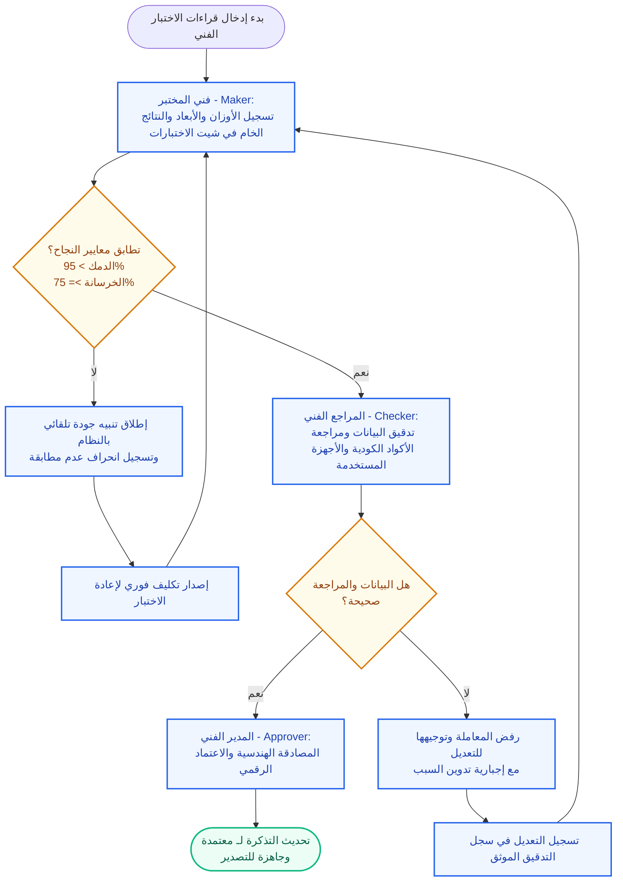
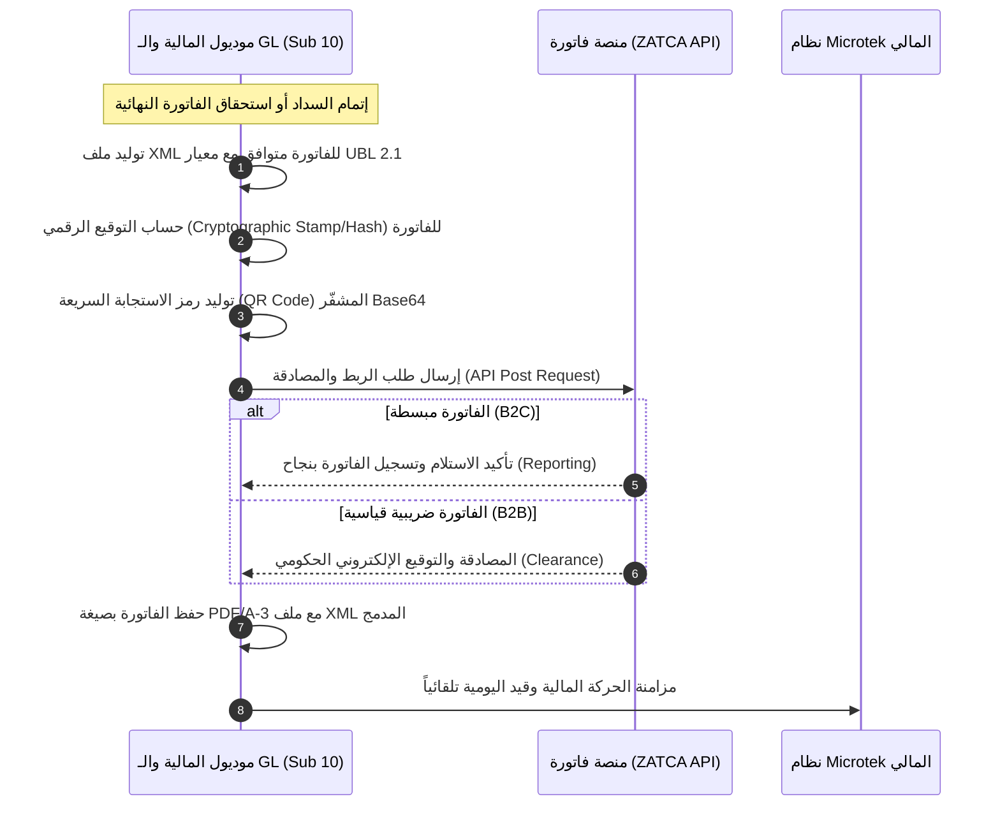
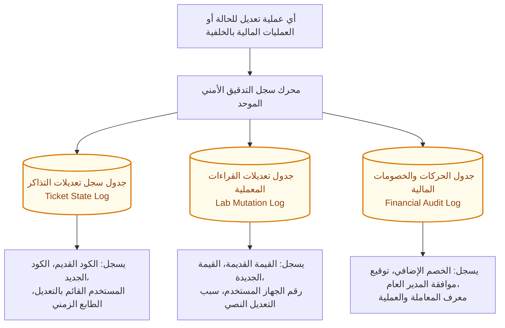

# المخطط الفني والتجاري لنظام رامسسكو (Ramssko Lab ERP/LIMS)
## الجزء الخامس: التكامل والامتثال والمعايير الأمنية
**الملف:** `05_Integrations_Compliance_and_Security.md`

---

### 1. الامتثال لمعايير الجودة الدولية (ISO/IEC 17025 Compliance)

يلتزم النظام برمجياً بكافة متطلبات المواصفة الدولية **ISO 17025** لضمان كفاءة مختبر الفحص والمعايرة ومصداقية النتائج المصدرة للعملاء، ويتم ذلك من خلال الآليات التالية:

#### أ. تدفق الاعتماد الثنائي للمكعبات والتربة (Maker-Checker Workflow):
* لا يمكن لأي نتيجة اختبار فني (مثل كسر خرسانة، دمك تربة، كثافة حقلية) أن تعتمد في التقرير النهائي بمدخل فردي.
* **صانع القرار (Maker):** يقوم فني المختبر بإجراء الاختبار الفعلي وإدخال القراءات والأوزان والقياسات الخام في شاشة "شيت الاختبارات".
* **المراجع الفني (Checker):** يقوم المهندس المدني الجيوتقني أو المراجع الفني بفحص القراءات ومطابقتها للتأكد من خلوها من الأخطاء الحسابية والتحقق من كود الاختبار المعتمد (مثل ASTM D1557).
* **الاعتماد الهندسي (Approver):** يقوم المدير الفني للمختبر باعتماد التقرير نهائياً ووضع توقيعه الهندسي، مما يسمح بتحديث حالة المعاملة.

#### ب. إدارة ومعايرة الأجهزة الحيوية:
* يرتبط موديول المختبر بموديول المعايرة (Sub 7). في حال انتهاء صلاحية معايرة أي جهاز (مثل مكبس كسر المكعبات الهيدروليكي، أو ميزان الكثافة الحقلية)، يتم قفل إمكانية اختياره أو إدخال نتائج فحص مرتبطة به في شيت الاختبارات تلقائياً.
* يتم تسجيل رقم الجهاز التسلسلي (Machine ID) وتاريخ آخر معايرة مع كل نتيجة اختبار لحفظ سلسلة التتبع الفني.

#### ج. سجل تدقيق قراءات الفحوصات (Test Results Audit Trail):
* يُمنع تعديل أي نتيجة اختبار بعد حفظها الأولي إلا بصلاحية خاصة يملكها المراجع الفني أو المدير الفني.
* في حال التعديل، يُلزم النظام المستخدم بكتابة **سبب التعديل** بالتفصيل، ويقوم النظام بتوثيق السجل في جدول التدقيق كالتالي:
  - معرف المستخدم القائم بالتعديل.
  - الطابع الزمني الدقيق للتعديل (Timestamp).
  - معرف الجهاز والمشروع والجسّة/العينة المعنية.
  - القيمة القديمة (Old Value) والقيمة الجديدة (New Value).
  - السبب النصي المدخل للتعديل.

---

### 2. متطلبات الربط الحكومي الضريبي (ZATCA E-Invoicing)

يتكامل موديول المالية ودفتر الأستاذ العام (Sub 10) بشكل كامل مع المنصة الحكومية لهيئة الزكاة والضريبة والجمارك (ZATCA) في المملكة العربية السعودية للامتثال لمتطلبات المرحلة الثانية (الربط والتكامل)، وفق المحددات التشغيلية التالية:

#### المتطلبات البرمجية للتكامل مع ZATCA:
1. **توليد الفاتورة بصيغة XML (UBL 2.1):**
   * يجب أن يقوم النظام ببناء الفاتورة بصيغة XML متوافقة بالكامل مع اشتراطات الهيئة، متضمنةً الحقول الإلزامية: الرقم الضريبي للمختبر (Ramssko VAT Number)، العنوان الوطني، الرقم الضريبي للعميل (في فواتير B2B)، وتفاصيل البنود والخدمات (فحص تربة، كسر خرسانة).
2. **التوقيع الرقمي وهش الفاتورة (Cryptographic Hash & Serial):**
   * يقوم النظام باحتساب الهش (Hash) لكل فاتورة وربطه بهش الفاتورة السابقة (Invoice Chain) لضمان عدم التلاعب بالفواتير التسلسلية.
   * إدراج رمز تعريف الفاتورة الفريد عالمياً (UUID) وعداد الفواتير المتسلسل بالنظام.
3. **ترميز رمز الاستجابة السريعة (QR Code Encryption):**
   * توليد رمز QR مشفر بصيغة Base64 يحتوي على خمسة حقول إلزامية: اسم المورد، الرقم الضريبي للمورد، تاريخ ووقت الفاتورة، إجمالي قيمة الفاتورة شاملة الضريبة، وإجمالي قيمة ضريبة القيمة المضافة (15%).
4. **تكامل واجهة التطبيق (API Integration):**
   * إرسال الفواتير بشكل لحظي عبر بروتوكول HTTPS إلى خوادم الهيئة للحصول على الترخيص والمصادقة (B2B Clearance) أو الإبلاغ (B2C Reporting).

---

### 3. التكامل المالي مع برنامج Microtek

يعمل نظام رامسسكو كمنظومة مونوث نمطي تدير الحسابات التشغيلية والمبيعات بكفاءة، ولكنه يعتمد على برنامج **Microtek** المالي الخارجي كدفتر الأستاذ العام الختامي والمطابقة المحاسبية الكبرى.

#### نقاط التكامل والمزامنة مع Microtek:
* **مزامنة العملاء وعروض الأسعار:** فور قبول العميل لعرض السعر رسمياً وتوقيعه، يتم إرسال بيانات العميل والاتصال إلى برنامج Microtek لإنشاء حساب عميل مرادف وتجنب التكرار.
* **مزامنة سندات القبض والدفعة المقدمة (50%):** عند اعتماد محاسب المبيعات للتحويل البنكي أو السداد الإلكتروني لدفعة التأمين المقدمة، يرسل النظام حركة مالية لقيد القبض إلى Microtek لتسجيل الدفعة الدائنة بحساب العميل.
* **مزامنة الفواتير النهائية والضرائب:** فور استلام الفاتورة النهائية المعتمدة من ZATCA، يتم دفع تفاصيل الفاتورة وقيمة ضريبة القيمة المضافة (15%) إلكترونياً إلى Microtek لتوليد قيد اليومية العام المباشر:
  - `من ح/ البنك أو ح/ ذمم العملاء`
  - `إلى ح/ إيرادات تشغيل المختبر`
  - `إلى ح/ ضريبة القيمة المضافة المستحقة`

---

### 4. التدقيق الأمني والصلاحيات (Security & System Audit)

#### أ. التحكم بالوصول المستند للأدوار (RBAC Rules):
يقيد النظام الوصول للواجهات والعمليات البرمجية بناءً على الدور الوظيفي للمستخدم بشكل صارم وصارم جداً:
* **فني الحفر (Driller):** لا يملك صلاحية الوصول للوحة التحكم بالمتصفح؛ يقتصر وصوله على تطبيق الهاتف المحمول للقيام بـ (تأكيد استلام المركبة، إثبات الإحداثيات والصور للجسات الميدانية).
* **فني المختبر (Lab Tech):** يملك فقط صلاحية عرض وإدخال القراءات في "شيت الاختبارات" للعينات المحولة له، ويُمنع من تعديل أي اختبار معتمد أو الاطلاع على الأسعار المالية للجسات.
* **المحاسب (Accountant):** يملك الصلاحيات المالية (الفواتير، سندات القبض، الخصومات المعتمدة، الربط مع Microtek و ZATCA) ويُمنع تماماً من تعديل أي نتيجة اختبار فنية.
* **المدير الفني والجيوتقني (Technical Director):** صلاحيات المراجعة والاعتماد الفني وإصدار التوصيات وتنزيل التقارير النهائية وتعديل القراءات الفنية المسجلة بالخطأ (مع التوثيق بسجل التدقيق).

#### ب. سجل تدقيق تعديل حالات المعاملات والعمليات المالية (Mutation Audit Log):
يسجل النظام تلقائياً أي تغيير في حالات البيانات الحيوية داخل جداول قاعدة البيانات لضمان الموثوقية الكاملة:

1. **سجل حالات التذاكر والعمليات (Ticket Mutation Log):**
   * يوثق أي تحول لحالة التذكرة (مثل الانتقال من `معلقة` إلى `تحت التنفيذ`). يتم تسجيل معرف الموظف القائم بالإجراء، الطابع الزمني، الحالة السابقة، والحالة الجديدة.
2. **سجل التعديلات والخصومات المالية (Financial Mutation Log):**
   * يُمنع التلاعب بالقيم المالية للجسات أو تغيير التسعير الثابت للبلديات إلا باعتماد موثق.
   * في حال تطبيق خصم خاص للعميل، يجب إدخال كود الموافقة المعتمد من المدير العام (أحمد فؤاد) أو المدير التنفيذي (محمود فؤاد)، ويسجل النظام تاريخ الموافقة والخصم الممنوح لضمان عدم وجود تلاعب مالي أو عمليات احتيال داخلي.
